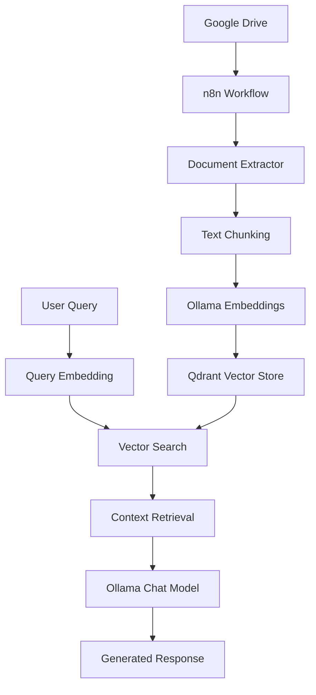

# 🤖 Sistema RAG con n8n y Ollama

[](https://n8n.io/)
[](https://ollama.com/)
[](https://qdrant.tech/)
[](https://www.docker.com/)
[](LICENSE)

> **Sistema RAG (Retrieval-Augmented Generation) completamente automatizado para procesamiento de documentos multiformat con modelos de IA locales**

**Autor:** Marlon Villada  
**Universidad:** Universidad Tecnológica de Pereira  
**Materia:** Programación III  
**Fecha:** Junio 2025

## 🎯 Descripción del Proyecto

Este proyecto implementa un sistema RAG completo que permite procesar múltiples tipos de documentos almacenados en Google Drive y responder preguntas sobre su contenido de forma completamente automatizada, utilizando modelos de IA ejecutados localmente para garantizar privacidad y control total sobre los datos.

### ✨ Características Principales

- 🔄 **Procesamiento Automatizado**: Pipeline completo desde descarga hasta respuesta
- 📄 **Soporte Multiformat**: PDF, Excel, Word, TXT
- 🧠 **IA Local**: Modelos Llama3.2 y nomic-embed-text ejecutados localmente
- 🔒 **Privacidad Total**: Sin dependencia de servicios externos de IA
- 💬 **Memoria Conversacional**: Mantiene contexto entre intercambios
- 🚀 **Dockerizado**: Fácil despliegue y escalabilidad

## 📋 Tabla de Contenidos

- [🎯 Descripción del Proyecto](#-descripción-del-proyecto)
- [💻 Especificaciones Técnicas](#-especificaciones-técnicas)
- [⚙️ Prerrequisitos](#️-prerrequisitos)
- [🚀 Instalación](#-instalación)
- [🔧 Configuración](#-configuración)
- [🏗️ Arquitectura del Sistema](#️-arquitectura-del-sistema)
- [🔄 Desarrollo del Pipeline](#-desarrollo-del-pipeline)
- [🧪 Pruebas y Validación](#-pruebas-y-validación)
- [❗ Solución de Problemas](#-solución-de-problemas)
- [📚 Glosario](#-glosario)
- [🤝 Contribución](#-contribución)
- [📄 Licencia](#-licencia)

## 💻 Especificaciones Técnicas

### Hardware Requerido
- **Procesador:** Intel Core i5-1135G7 @ 2.40GHz (mínimo)
- **Memoria RAM:** 8 GB DDR4 (recomendado 16 GB)
- **Almacenamiento:** SSD NVMe 477 GB (mínimo 200 GB libres)
- **Tarjeta Gráfica:** Intel Iris Xe Graphics (o equivalente)
- **Sistema Operativo:** Windows 11 Home (o superior)

### 🔧 Stack Tecnológico

| Componente | Tecnología | Versión | Descripción |
|------------|------------|---------|-------------|
| **Automatización** | n8n | Latest | Orquestación de workflows |
| **Base de Datos Vectorial** | Qdrant | Latest | Almacenamiento de embeddings |
| **Modelo de Chat** | Llama3.2 | 3B | Generación de respuestas |
| **Modelo de Embeddings** | nomic-embed-text | Latest | Vectorización de texto |
| **Orquestador de IA** | Ollama | Latest | Gestión de modelos locales |
| **Contenedores** | Docker | Latest | Virtualización de servicios |
| **Integración** | Google Drive API | v3 | Acceso a documentos |

---

## ⚙️ Prerrequisitos

### Activación de Características de Windows

1. **Habilitar Virtualización en BIOS/UEFI:**
   - Reiniciar el equipo y acceder a BIOS/UEFI
   - Buscar "Virtualization Technology" o "Intel VT-x"
   - Habilitarlo y guardar cambios

2. **Activar Características de Windows:**
   ```powershell
   # Ejecutar PowerShell como Administrador
   dism.exe /online /enable-feature /featurename:Microsoft-Windows-Subsystem-Linux /all /norestart
   dism.exe /online /enable-feature /featurename:VirtualMachinePlatform /all /norestart
   ```

3. **Reiniciar el sistema** tras activar las características

---

## 🚀 Instalación

### Paso 1: Instalación de WSL2 y Ubuntu

1. **Instalar WSL2:**
   ```powershell
   # En PowerShell como Administrador
   wsl --install
   ```

2. **Instalar Ubuntu:**
   ```powershell
   wsl --install -d Ubuntu
   ```

3. **Configurar usuario de Ubuntu:**
   - Crear usuario y contraseña cuando se solicite
   - Actualizar el sistema:
   ```bash
   sudo apt update && sudo apt upgrade -y
   ```

### Paso 2: Instalación de Docker Desktop

1. **Descargar Docker Desktop:**
   - Visitar: https://www.docker.com/products/docker-desktop/
   - Descargar la versión para Windows

2. **Instalar Docker Desktop:**
   - Ejecutar el instalador descargado
   - Seguir el asistente de instalación
   - **Importante:** Marcar "Use WSL 2 instead of Hyper-V"

3. **Configurar Docker Desktop:**
   - Abrir Docker Desktop
   - Ir a Settings → General
   - Verificar que "Use the WSL 2 based engine" esté marcado
   - Ir a Settings → Resources → WSL Integration
   - Habilitar integración con Ubuntu

4. **Verificar instalación:**
   ```bash
   # En terminal Ubuntu
   docker --version
   docker-compose --version
   ```

### Paso 3: Instalación de Ollama

1. **Instalar Ollama en Ubuntu:**
   ```bash
   # Descargar e instalar Ollama
   curl -fsSL https://ollama.com/install.sh | sh
   ```

2. **Verificar instalación:**
   ```bash
   ollama version
   ```

3. **Iniciar servicio Ollama:**
   ```bash
   # Iniciar Ollama en segundo plano
   ollama serve &
   ```

### Paso 4: Descarga de Modelos de IA

1. **Descargar modelo de Chat:**
   ```bash
   ollama pull llama3.2:3b
   ```

2. **Descargar modelo de Embeddings:**
   ```bash
   ollama pull nomic-embed-text:latest
   ```

3. **Verificar modelos descargados:**
   ```bash
   ollama list
   ```

### Paso 5: Configuración de Contenedores

1. **Crear directorio del proyecto:**
   ```bash
   mkdir ~/rag-n8n-project
   cd ~/rag-n8n-project
   ```

2. **Crear archivo docker-compose.yml:**
   ```yaml
   version: '3.8'
   
   services:
     n8n:
       image: n8nio/n8n:latest
       restart: unless-stopped
       ports:
         - "5678:5678"
       environment:
         - DB_TYPE=sqlite
         - DB_SQLITE_VOLUMES=/data
         - GENERIC_TIMEZONE=America/Bogota
         - N8N_SECURE_COOKIE=false
         - WEBHOOK_URL=http://localhost:5678/
       volumes:
         - ./n8n-data:/home/node/.n8n
         - ./shared-data:/data
       networks:
         - rag-network
   
     qdrant:
       image: qdrant/qdrant:latest
       restart: unless-stopped
       ports:
         - "6333:6333"
         - "6334:6334"
       volumes:
         - ./qdrant-data:/qdrant/storage
       networks:
         - rag-network
   
   networks:
     rag-network:
       driver: bridge
   
   volumes:
     n8n-data:
     qdrant-data:
     shared-data:
   ```

3. **Crear directorios necesarios:**
   ```bash
   mkdir -p n8n-data qdrant-data shared-data
   ```

4. **Levantar los contenedores:**
   ```bash
   docker-compose up -d
   ```

5. **Verificar que los contenedores estén ejecutándose:**
   ```bash
   docker-compose ps
   ```

---

## 🔧 Configuración

### Configuración de Google Drive API

1. **Crear proyecto en Google Cloud Console:**
   - Ir a: https://console.cloud.google.com/
   - Crear nuevo proyecto o seleccionar existente
   - Habilitar Google Drive API

2. **Crear credenciales:**
   - Ir a "Credenciales" → "Crear credenciales" → "ID de cliente OAuth 2.0"
   - Tipo de aplicación: "Aplicación web"
   - Agregar URL de redirección: `http://localhost:5678/rest/oauth2-credential/callback`

3. **Descargar archivo JSON de credenciales**

### Configuración inicial de n8n

1. **Acceder a n8n:**
   - Abrir navegador en: http://localhost:5678
   - Crear cuenta de administrador inicial

2. **Configurar credenciales de Google Drive:**
   - Ir a "Credentials" → "Add Credential"
   - Seleccionar "Google Drive OAuth2 API"
   - Subir archivo JSON de credenciales
   - Completar proceso de autenticación OAuth2

3. **Configurar conexión con Ollama:**
   - Verificar que Ollama esté accesible desde n8n
   - URL de Ollama: `http://host.docker.internal:11434`

### Configuración de Qdrant

1. **Verificar conexión:**
   ```bash
   curl http://localhost:6333/collections
   ```

2. **Crear colección para vectores:**
   ```bash
   curl -X PUT http://localhost:6333/collections/documents \
     -H "Content-Type: application/json" \
     -d '{
       "vectors": {
         "size": 768,
         "distance": "Cosine"
       }
     }'
   ```

---

## 🏗️ Arquitectura del Sistema



### 🔄 Flujo de Datos

1. **Ingesta de Documentos**: Google Drive → n8n → Extractores especializados
2. **Procesamiento**: Chunking → Embeddings → Almacenamiento vectorial
3. **Consulta**: Query → Embedding → Búsqueda semántica → Generación de respuesta

---

## 🔄 Desarrollo del Pipeline

### Workflow de Procesamiento de Documentos

#### Nodos del Pipeline Principal:

1. **Google Drive Trigger**
   - Monitorea carpeta específica
   - Detecta nuevos archivos automáticamente

2. **File Classification (SelectorIQ)**
   - Identifica tipo de archivo (PDF, Excel, Word, TXT)
   - Dirige a extractor apropiado

3. **Extractores Especializados:**
   - **PDF Extractor:** Para documentos PDF
   - **Excel Extractor:** Para archivos .xlsx, .xls
   - **Word Extractor:** Para archivos .docx, .doc
   - **Text Extractor:** Para archivos .txt

4. **Content Aggregation**
   - Consolida contenido de todos los extractores
   - Normaliza formato de salida

5. **Text Chunking**
   - Divide documentos en fragmentos de 1000 tokens
   - Mantiene coherencia semántica

6. **Embedding Generation**
   - Genera vectores usando nomic-embed-text
   - Procesa cada chunk individualmente

7. **Vector Storage**
   - Almacena embeddings en Qdrant
   - Indexa para búsqueda eficiente

### Workflow Conversacional

#### Nodos del Sistema de Chat:

1. **Chat Trigger**
   - Recibe mensajes del usuario
   - Inicia proceso de respuesta

2. **Query Embedding**
   - Convierte pregunta en vector
   - Usa mismo modelo que documentos

3. **Similarity Search**
   - Busca chunks relevantes en Qdrant
   - Retorna top-k resultados más similares

4. **Context Preparation**
   - Prepara contexto para el modelo
   - Combina chunks relevantes

5. **Response Generation**
   - Genera respuesta usando Llama3.2:3b
   - Incluye contexto conversacional

6. **Memory Management**
   - Mantiene historial de conversación
   - Gestiona contexto a largo plazo

---

## 🧪 Pruebas y Validación

### Pruebas de Conectividad

1. **Verificar servicios:**
   ```bash
   # Verificar n8n
   curl http://localhost:5678/healthz
   
   # Verificar Qdrant
   curl http://localhost:6333/collections
   
   # Verificar Ollama
   curl http://localhost:11434/api/tags
   ```

2. **Pruebas de modelos:**
   ```bash
   # Probar modelo de chat
   ollama run llama3.2:3b "Hola, ¿cómo estás?"
   
   # Probar modelo de embeddings
   curl http://localhost:11434/api/embeddings \
     -d '{"model": "nomic-embed-text", "prompt": "texto de prueba"}'
   ```

### Pruebas Funcionales

1. **Subir documento de prueba a Google Drive**
2. **Verificar procesamiento automático en n8n**
3. **Comprobar almacenamiento de vectores en Qdrant**
4. **Realizar consultas de prueba**
5. **Validar calidad de respuestas**

### Pruebas de Rendimiento

1. **Tiempo de procesamiento por tipo de documento**
2. **Memoria utilizada durante vectorización**
3. **Velocidad de búsqueda semántica**
4. **Tiempo de respuesta del chat**

---

## 🔧 Solución de Problemas Comunes

### Problemas de Docker

**Error: "Docker daemon is not running"**
```bash
# Reiniciar Docker Desktop
# O en Ubuntu:
sudo systemctl restart docker
```

**Contenedores no se comunican:**
```bash
# Verificar red Docker
docker network ls
docker network inspect rag-n8n-project_rag-network
```

### Problemas de Ollama

**Modelos no se descargan:**
```bash
# Verificar espacio en disco
df -h

# Limpiar modelos no utilizados
ollama rm [modelo_no_usado]
```

**Ollama no responde:**
```bash
# Reiniciar servicio
pkill ollama
ollama serve &
```

### Problemas de n8n

**No puede conectar con Ollama:**
- Verificar URL: `http://host.docker.internal:11434`
- Comprobar que Ollama esté ejecutándose

**Errores de Google Drive:**
- Regenerar credenciales OAuth2
- Verificar permisos de carpeta

---

## 📚 Glosario de Términos

**AI Agent:** Componente inteligente en n8n que procesa y comprende las consultas de los usuarios utilizando capacidades de inteligencia artificial.

**Aggregate:** Nodo de n8n que consolida y combina datos de múltiples fuentes en una estructura unificada.

**Chunking:** Proceso de dividir documentos largos en fragmentos más pequeños y manejables para su procesamiento, aplicable a PDF, Word, Excel y archivos de texto.

**Contenedor:** Unidad de software que empaqueta una aplicación y sus dependencias para ejecutarse de forma aislada.

**Docker Compose:** Herramienta para definir y ejecutar aplicaciones Docker multi-contenedor usando archivos YAML.

**Embedding:** Representación numérica (vectorial) de texto que captura su significado semántico para facilitar comparaciones y búsquedas.

**Ollama:** Plataforma para ejecutar modelos de lenguaje grandes de forma local, optimizada para hardware consumer.

**Procesamiento Multiformato:** Capacidad del sistema para manejar y extraer información de diferentes tipos de archivo (PDF, Excel, Word, texto) de manera unificada.

**Qdrant:** Base de datos vectorial especializada diseñada para almacenar y realizar búsquedas semánticas eficientes sobre embeddings.

**RAG (Retrieval-Augmented Generation):** Técnica que combina la recuperación de información relevante con la generación de texto para producir respuestas más precisas y contextualizadas.

**Summarize:** Nodo de n8n que genera resúmenes automáticos del contenido procesado para facilitar su comprensión.

**WSL2 (Windows Subsystem for Linux 2):** Capa de compatibilidad que permite ejecutar un entorno Linux directamente en Windows.

---

## 📞 Soporte y Recursos

### Documentación Oficial:
- **n8n:** https://docs.n8n.io/
- **Qdrant:** https://qdrant.tech/documentation/
- **Ollama:** https://ollama.com/docs/
- **Docker:** https://docs.docker.com/

### Comunidades:
- **n8n Community:** https://community.n8n.io/
- **Qdrant Discord:** https://discord.gg/qdrant
- **Ollama GitHub:** https://github.com/ollama/ollama

---

**Nota:** Esta guía está basada en la implementación realizada por Marlon Villada para el curso de Programación III en la Universidad Tecnológica de Pereira. Para consultas específicas sobre la implementación, contactar al autor a través de los canales oficiales de la universidad.
